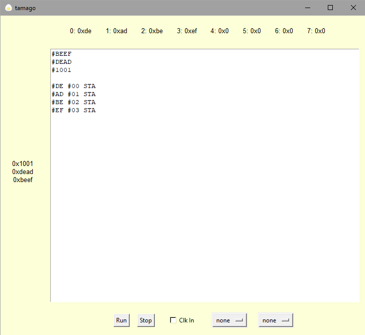

# tamago


## What is it?

tamago is a livecoding platform for controlling musical events in time.  
It does this via midi I/O.  
You might think of it as a sequencer you program in assembly!  
The language it uses is a modified uxntal, the language used in Hundred Rabbit's [uxn project](https://100r.co/site/uxn.html).  
uxn is a stack oriented computer, with an intentionally easy to understand design.  

## Backstory

In November of 2021, I discovered compudanza's [one week tutorial program]((https://compudanzas.net/uxn_tutorial.html) for learning uxn.  
I highly recommend going through that tutorial too!  
Through that week or so I wrote some simple little programs, some of which you can [look over here](/projects/uxn.html).  
  
I've found in my life that when I happen on an interesting idea, or technology, my first thought is always, "how can I make music with this?", and this project was not unique in that respect.  
At the time [Varvara](https://wiki.xxiivv.com/site/varvara.html) did not support midi, though that has since changed!  
Therefore, I set out to write a simple uxntal interpreter, so one could sequence midi events, by livecoding in a modified uxntal.  
tamago is the result of that work.  


## Download the prebuilt program

Click on releases on the right hand side, then download the latest release for your OS.  
Once you unzip the program, you can run it!

## Running the Program from source

First clone the repo with `git clone https://github.com/beserge/tamago`  
Next, move into that folder with `cd tamago`  
Install the dependencies with `pip install -r requirements.txt`  
Using python 3 run `python tamago.py`  
  
## Program Layout

- The main area is a large box where you type in your code.  
- To the left is the stack display, where you can see the top 25 elements on the stack.  
- Above is the contents of the first 8 variables. There are 256 available, but only the first 8 are displayed.  
- Below are the main program controls.  
- From left to right these are program run and stop
- Clk In (clock from midi in when checked, internal clock when unchecked)
- Midi In selector, Midi Out selector



## Using Midi
- On Windows you'll need to download a loopback. I recommend [loopmidi](https://www.tobias-erichsen.de/software/loopmidi.html) by the wonderful Tobias Erichsen.  
- On macOs you'll have to enable the internal IAC bus. You can find instructions for doing so [here](https://help.ableton.com/hc/en-us/articles/209774225-Setting-up-a-virtual-MIDI-bus), courtesy of the nice folks at Ableton.  
## Language Primer

The language is a modified version of the [uxntal](https://wiki.xxiivv.com/site/uxntal.html) used on the [Varvara Computer](https://wiki.xxiivv.com/site/varvara.html).

### Hexadecimal

Hexadecimal is a "base-16" number system. It is how we write numbers in uxntal.  
If you're unfamiliar with hex, you can read up on it [here](https://computersciencewiki.org/index.php/Hexadecimal).  

### What is a stack?

A stack, otherwise referred to as a LIFO (Last In, First Out), is a type of data structure.  
It is the main thing you are manipulating when programming in uxntal, and by extension in tamago.  
You can visualize it like a stack of cards, or maybe pancakes, (or in our case data).  

The two basic operations you can do are putting something on top of the stack, or taking the top item off.  
These are referred to as `PUSH` and `POP` respectively. You might hear someone say "just push it on the stack"!

In tamago we use the shorthand `#F7` to mean `PUSH` the number `0xF7` on the stack.
We can use the `POP` command to remove the top item from the stack, and throw it away.

The left side of the screen in tamago is a display of the stack as of the last CLK command.  
You can also force the stack display to update at any time using the `PRINT` command.  
Additionally, you can read some more on stacks [here](https://computersciencewiki.org/index.php/Stack) if it is still unclear.

### How do the commands work with the stack?

If you are familiar with the concept of Reverse Polish Notation, this will be familiar to you!  
If not, have no fear it is quite simple.  

It will be easiest to explain this with an example. Say you want to divide `0x09` by `0x03`  
Here is how we can do this in uxn.

```uxntal
#09 ( push 0x09 on the stack )
#03 ( push 0x03 on the stack )
DIV ( divide 0x09 / 0x03, and push the result on the stack )
```

That's it!  
It's important to note the order of operations here.  
The item further down 


stack goes to the left, and the operator goes between.  

### Labels

In my modified uxntal, labels are used for two purposes:

1. Referring to points to jump to with `JMP` and `JCN`
2. Interacting with midi via `DEO`

Labels can be pushed and popped from the stack just like integers.
You can read more about the commands that use labels in the Language Reference.  

### Comments

Comments are nested between parenthesis.  
Make sure to include a space between the parenthesis and the comment!  
  
`#01 ( Push 0x01 on the stack )`
  
### Macros

Macros are reusable bits of code. They are given a name, and a code body.
They can be used in your code simply by writing the name.  
```uxntal
%ADD_TWO { #02 ADD }   ( this macro adds 0x02 to the item on the stack )

#03 ( push 0x03 on the stack )
ADD_TWO ( add two to it using our macro )
```

You can also use macros inside of other macros!  
```uxntal
%NUM { #02 }   ( this macro pushed 0x02 on the stack )
%ADD_NUM { NUM ADD }   ( this macro adds 0x02 to the item on the stack )

#03   ( push 0x03 on the stack )
ADD_NUM   ( add two to it using our macro )
```
### Variables

You can store and load data for safe keeping in a few variable slots.  
You can see the variable storage (as of the last clock tick) at the top of the screen.  
The `PRINT` command will force this screen to update.  
The `LDA` and `STA` commands are used to store and load data from these variable slots.  
You can read more on them below in the Language Reference.  

## Language Reference

### Stack Manipulation

- `#0C` Pushes a hexidecimal number onto the top of the stack. In this case we will end up with 0x0C, or 12 on top.
- `POP` Removes item on top of the stack and throws it away! `a --` 
- `NIP` Removes the second item from the stack. `a b -- a`
- `DUP` Duplicates the item on top of the stack. `a -- a a`
- `OVR` Duplicates the top item to the third slot. `a b -- a b a`
- `SWP` Swaps the two items on top of the stack. `a b -- b a`
- `ROT` Rotates the stack elements (up one slot). The top element wraps around. `a b c -- b c a`

### Math
- `INC` Add 1 to the top element. `a -- (a + 1)` `0x0C -- 0x0D`
- `ADD` Add the top two elements and push the result. `a b -- (a + b)` `0x02 0x03 -- 0x05`
- `SUB` Subtract the top two elements and push the result. `a b -- (a-b)` `0x05 0x03 -- 0x02`
- `MUL` Multiply the top two elements and push the result. ` a b -- (a*b)` `0x03 0x02 -- 0x06`
- `DIV` Divide the top two elements and push the result. `a b -- (a/b)` `0x08 0x02 -- 0x04`

### Logic
These operate on the top two items, pushing 0x01 if the operation is true, and 0x00 if it is not.

- `EQU` a is equal to b. `a b -- (a==b)` `0x03 0x04 -- 0x00` `0x05 0x05 -- 0x01`
- `NEQ` a is not equal to b. `a b -- (a!=b)` `0x03 0x04 -- 0x01` `0x05 0x05 -- 0x00`
- `GTH` a is greater than b. `a b -- (a>b)` `0x05 0x02 -- 0x01` `0x02 0x05 -- 0x00`
- `LTH` a is less than b. `a b -- (a < b)` `0x05 0x02 -- 0x00` `0x02 0x05 -- 0x01`

### Bitwise Operators
Twiddle some bits! These operate on the binary representation of numbers.

- `AND` Bitwise and of a, b. `a b -- (a&b)` `0x05 0x06 -- 0x04`
- `ORA` Bitwise or of a, b. `a b -- (a|b)` `0x05 0x06 -- 0x07`
- `EOR` Exclusive or of a, b. `a b -- (a^b)` `0x05 0x06 -- 0x03`
- `SFT` Bitshift the a by the control value b. b is seperated into a high and low nibble. If b is 0x12, 1 is the high nibble, and 2 is the low nibble.
        a is shifted right by the low nibble, then left by the high nibble. `a b -- c` 
        `0x04 0x01 -- 0x02`
        `0x04 0x10 -- 0x08`
        `0x04 0x11 -- 0x04`

### Variables

We include a simple system for storing and retrieving data off of the stack for later.  
We use integer addresses to refer to the different variables.  
There are 128 slots as of now, and the first 8 are displayed at the top of the screen.  

- `LDA` Load the item from the specified address. `a --`
- `STA` Store data a in address b. `a b --`

### Jumps
- `JMP` Jump to the label specified. `a --`
  - An infinite loop:

```uxntal
@loop
( do this forever... )
;loop JMP
```

- `JCN` Jump, if the conditional is not 0. `a b --`
  - Loops 5 times:

```uxntal
#00

@loop

INC ( Increment the counter )
DUP ( Duplicate the counter)
#05 LTH ( If the counter < 5 push a 1, else push a 0 )

CLK ( wait for a clock tick )
;loop JCN ( if there is a 1 on the stack, jump to @loop, else keep going )
```

### Midi
Midi funcionality all uses `DEO` or "DEvice Out".

| Command | Effect |
| --- | --- |
| `#50 ;note DEO` | Set the midi note value to `0x50` |
| `#50 ;vel DEO` | Set the midi velocity value to `0x50` |
| `#00 ;chn DEO` | Set the midi channel value to `0x00` |
| `#02 ;len DEO` | Set the midi note length (in 16th notes) to `0x02` |
| `#00 ;midi DEO` | Send a midi Note On message with the current settings |

### Clock and Tempo
- `BPM` Set the BPM in beats per second. The clock defaults to 16th notes. 
  - `#50 BPM` will set the clock to sixteenth notes at 80 bpm.
- `CLK` pauses until the next clock tick. Can also be written as `*`
  - `#00 INC***` will push `0x00 ` on the stack, increment it, then wait three ticks.

### Et Cetera
- `BRK` Stops the program.
- `CLS` Clear the stack.
- `PRINT` Force the stack / memory displays to update.  

The Language section here was partially based on the [uxntal reference](https://wiki.xxiivv.com/site/uxntal_reference.html).

### Gotchas

If you are already familiar with uxntal, you'll find the following differences here:  
- No return stack. No `STH`.  
- No keep mode.  
- No difference between shorts and bytes. All numbers are actually python ints ;)  
- Memory addresses aren't actually bytes. You have to jump to your label since the `;label` is just a string.    
- No zero page, relative, abs, etc. The `LDA/STA` have been overloaded with simple variable storage.  
- | . $ , & : ' ~ " We have no need for these things as of yet.
- No `LIT` command, just use `#` to push number on the stack.  

## More Important Details

As of the time of writing:

- Your code is only parsed each time you hit Run. Hitting this also sends the program back to the start.  
- If your code contains any errors the parsing will halt and the old code will run.  
- Any time a command cannot be run the error is simply caught and ignored.  
  - A program like `#00 SUB` will just push 0 on the stack, then halt with 0 still on the stack ( after failing to do the subtraction )
- Stop just pauses execution. 
- Tick the Clock In box to sync the clock to your midi in source.
- There are midi I/O selection dropdowns at the bottom. These are populated on launch, so any midi devices must be ready to go when you launch the app.

## Future Plans

- Add Midi ctrl, noteoff, pitchbend, etc. To `DEO`
- Add `DEI`
- Add OSC compatability
- Add clock out
- Improve graphics
- Create executable / installer / make it portable
- Unit testing
- Implement the return stack
- File load / write
- Make two clicks of stop / run behave how they should. (todo)

## Further Reading

- For more language info, see this _excellent_ guide to [uxntal on Varvara](https://compudanzas.net/uxn_tutorial_day_1.html).  
- Read some example programs in this repo's examples folder. Feel free to submit any you come up with!  
- Check out the macros.md file for a list of useful macros. Feel free to submit your own!  

