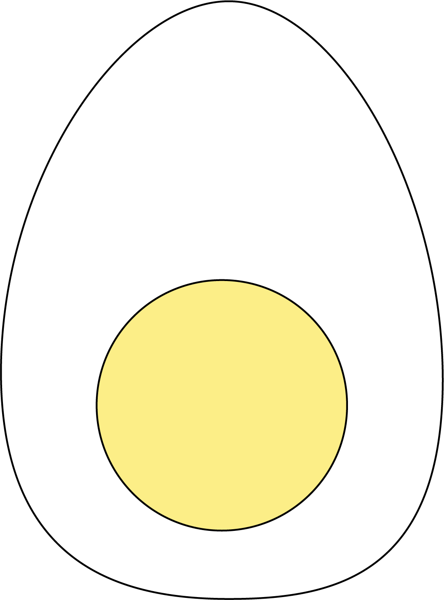

# tamago



Livecoding music sequencer based on [uxn](https://wiki.xxiivv.com/site/uxn.html) and more loosely [Orca](https://github.com/hundredrabbits/Orca), both by the wonderful [Hundred Rabbits](https://github.com/hundredrabbits).

Check out a [Demo video of a buggy alpha build](https://www.youtube.com/watch?v=dOmFJSYxNow)

## Running the Program

Using python 3 run `python tamago.py`.  
The one dependency right now is pygame for its midi capablities.  
You can install that with `pip install pygame`  
We also depend on tkinter, but I think that comes by default...

## Language

The language is a modified version of the [uxntal](https://wiki.xxiivv.com/site/uxntal.html) used on the [Varvara Computer](https://wiki.xxiivv.com/site/varvara.html).

If you're familiar with uxntal, here's a list of the things that work differently.

#### Push

There is no `LIT` command. If you want to push a number on the stack, use the `#` syntactic sugar. 

That's `#2F` to push 0x2F onto the stack.

#### DEO / DEI

This is overloaded to work with midi ( and eventually OSC and so on ).

| Command | Effect |
| --- | --- |
| `#50 ;note DEO` | Set the midi note value to 0x50 |
| `#50 ;vel DEO` | Set the midi velocity value to 0x50 |
| `#00 ;chn DEO` | Set the midi channel value to 0x00 |
| `#02 ;len DEO` | Set the midi note length (in 16th notes) to 0x02 |
| `#00 ;midi DEO` | Send a midi Note On message with the current settings |

`;midi DEO` will be extended soon with options for note off, control messages, etc.

#### Labels

These aren't really memory locations like they are in the full implementation, so no fun math tricks here! These are simply to be used as locations for the jump instructions.

The only label available borrows from the literal address absolute notation.  
That's `@label` to create a label and `;label` to push it onto the stack

So to create a loop for example: 
```
@loop
( do something here )
;loop JMP
```

Labels are also overloaded for the DEO / DEI midi implementation. Check that section for more details.

#### STA / LDA

This is overloaded with a simple store / load system for variables. There are 128 slots available to store integers. If you want to label your variables, for now the best way is with a macro.

```
%VAR1 { #00 } ( variable 1 )

#04 VAR1 STA ( store 0x04 in variable 1 )
VAR1 LDA ( load variable one onto the stack )
```

#### Missing Commands / things

- The return stack hasn't been implemented (yet). `STH` therefore is not implemented.
- `LDZ / STZ`, `LDR / STR`. Addresses aren't really a thing as such, so we just use `STA / LDA` as described above.
- `| . $ , & : ' ~ "` We have no need for these things as of yet.
- BRK (todo)
- Short versions of commands. 

#### New Commands!

`CLK`: waits until the next clock pulse. Also updates the stack display.   
`BPM`: sets the quarter note clock speed in beats per minute. The actual ticks will happen 4 times faster (16th note clock)  
`PRINT`: forces the stack display to update. Otherwise this only happens once per clock.  

## Future Plans

- Add Midi ctrl, noteoff, pitchbend, etc. To `DEO`
- Add `DEI`
- Add OSC compatability
- Add clock out
- Improve graphics
- Create executable / installer / make it portable
- Unit testing
- Implement the return stack
- File load / write
- Beginner's guide to my modified uxntal.
- Make two clicks of stop / run behave how they should. (todo)

## More Important Details

As of the time of writing:

- Your code is only parsed each time you hit Run. Hitting this also sends the program back to the start.  
- If your code contains any errors the parsing will halt and the old code will run. This doesn't throw any errors at the moment. ( todo )
- Any time a command cannot be run the error is simply caught and ignored.  
  - A program like `#00 SUB will just push 0 on the stack, then halt with 0 still on the stack ( after failing to do the subtraction )
- Stop just pauses execution. 
- Tick the Clock In box to sync the clock to your midi in source.
- There are midi I/O selection dropdowns at the bottom. These are populated on launch, so any midi devices must be ready to go when you launch the app.

## Further Reading

- For more language info, see this _excellent_ guide to [uxntal on Varvara](https://compudanzas.net/uxn_tutorial_day_1.html).  
- Read some example programs in this repo's examples folder. Feel free to submit any you come up with!  
- Check out the macros.md file for a list of useful macros. Feel free to submit your own!  
